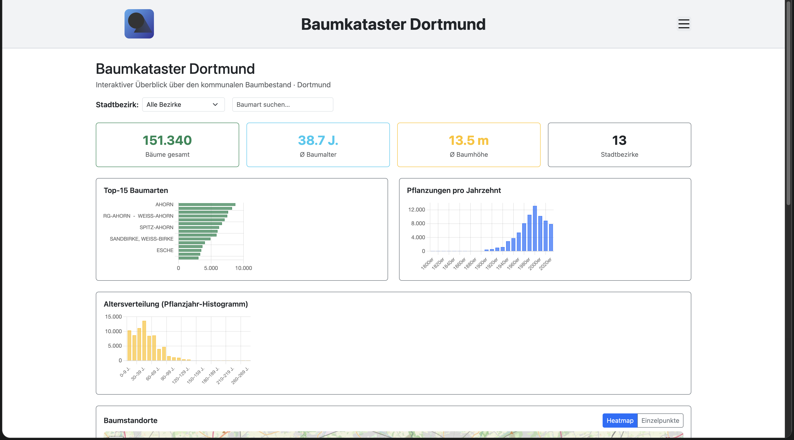
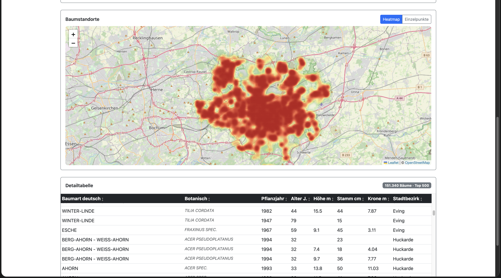

# Kommunaler Baumkataster – App für den Open Data App-Store (ODAS)

Interaktive Visualisierung des kommunalen Baumbestands für den [Open Data App Store](https://open-data-app-store.de/). Entspricht der [Open Data App-Spezifikation](https://open-data-apps.github.io/open-data-app-docs/open-data-app-spezifikation/). Mehr unter https://github.com/open-data-apps

---

## Funktionen





Single Page Application mit Logo, Menü, Impressum/Datenschutz/Kontakt-Seiten und Fußzeile. Die Konfiguration wird vom ODAS geladen. Inhalte:

- **Kennzahlen**: Gesamtanzahl Bäume, Ø Baumalter, Ø Baumhöhe, Anzahl Stadtbezirke
- **Top-15 Baumarten**: Horizontales Balkendiagramm
- **Pflanzungen pro Jahrzehnt**: Balkendiagramm je Dekade
- **Altersverteilung**: Histogramm nach Standalter
- **Kartenansicht**: Interaktive Karte (Leaflet.js/OpenStreetMap) mit Heatmap und WebGL-Einzelpunkten (Leaflet.glify), umschaltbar; Filter wirken auf die Karte
- **Stadtbezirk-Filter** und **Baumart-Suche**

---

## Datenformat

Unterstützt **JSON** (Objekt mit `results`-Array, z.B. OpenDataSoft `/records`) und **CSV** (Semikolon-separiert, z.B. `/exports/csv`). Die Erkennung erfolgt automatisch anhand der URL.

---

## Kompatible Datensätze

Kommunale Baumkataster-Datensätze mit folgenden Kernfeldern (Feldnamen per Konfiguration anpassbar):

| Schema-Feld        | Beschreibung         | Dortmund-Beispiel |
| ------------------ | -------------------- | ----------------- |
| `id`               | Eindeutige Baum-ID   | `id`              |
| `art_botanisch`    | Botanischer Artname  | `art_botani`      |
| `art_deutsch`      | Deutscher Artname    | `art_deutsc`      |
| `pflanzjahr`       | Pflanzjahr           | `pflanzjahr`      |
| `standalter_jahre` | Standalter in Jahren | `standalter`      |
| `baumhoehe_m`      | Baumhöhe in Metern   | `baumhoehe`       |
| `stadtbezirk_name` | Stadtbezirk          | `stadtbezbe`      |

---

## Entwicklung

**Voraussetzungen:** Docker / Docker Compose, Make

```bash
make build up
```

App läuft auf http://localhost:8089 (Konfiguration wird lokal geladen).

### Wichtige Dateien

| Datei                      | Beschreibung                                                            |
| -------------------------- | ----------------------------------------------------------------------- |
| `app.js`                   | Hauptlogik: Datenladen, Aufbereitung, Chart.js-Diagramme, Leaflet-Karte |
| `app-package.json`         | App-Metadaten und Instanz-Konfigurationsfelder für den ODAS             |
| `schema.json`              | Frictionless Data Schema – allgemeingültiges Datenmodell                |
| `assets/odas-app-icon.svg` | App-Icon                                                                |
| `config.json`              | Lokale Konfiguration für die Entwicklung                                |

---

## Konfiguration (Instanz)

| Parameter          | Beschreibung                                      | Pflicht |
| ------------------ | ------------------------------------------------- | ------- |
| `apiurl`           | URL zum JSON- oder CSV-Endpunkt der Baudaten      | ja      |
| `urlDaten`         | URL zur Katalog-Seite des Datensatzes im ODP      | ja      |
| `stadtbezirk-feld` | Feldname für Stadtbezirk im Quelldatensatz        | ja      |
| `baumart-feld`     | Feldname für deutschen Artnamen im Quelldatensatz | ja      |
| `pflanzjahr-feld`  | Feldname für Pflanzjahr im Quelldatensatz         | ja      |
| `baumhoehe-feld`   | Feldname für Baumhöhe im Quelldatensatz           | nein    |
| `standalter-feld`  | Feldname für Standalter im Quelldatensatz         | nein    |
| `titel`            | Anzeigetitel der App                              | ja      |
| `seitentitel`      | Browser-Tab-Titel                                 | ja      |

---

## Autor

© 2026, Ondics GmbH
