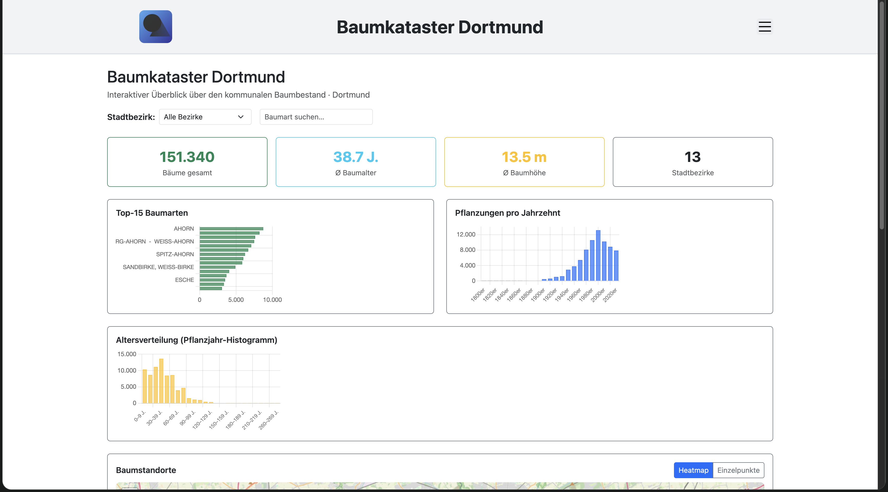
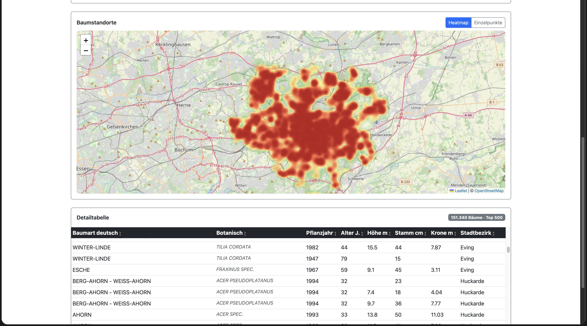

# Baumkataster – App für den Open Data App-Store (ODAS)

Die App **Baumkataster** bietet eine interaktive Visualisierung des kommunalen Baumbestands einer Stadt.

Die App ist für die Verwendung im [Open Data App Store](https://open-data-app-store.de/) gemacht
und entspricht der [Open Data App](https://open-data-apps.github.io/open-data-app-docs/open-data-app-spezifikation/).

Mehr zu Open Data Apps unter https://github.com/open-data-apps

---

## Funktionen





Single Page Application mit Logo, Menü, Impressum/Datenschutz/Kontakt-Seiten und Fußzeile. Die Konfiguration wird vom ODAS geladen. Inhalte:

- **Kennzahlen**: Gesamtanzahl Bäume, Ø Baumalter, Ø Baumhöhe, Anzahl Stadtbezirke
- **Top-15 Baumarten**: Horizontales Balkendiagramm
- **Pflanzungen pro Jahrzehnt**: Balkendiagramm je Dekade
- **Altersverteilung**: Histogramm nach Standalter
- **Kartenansicht**: Interaktive Karte (Leaflet.js/OpenStreetMap) mit Heatmap und WebGL-Einzelpunkten (Leaflet.glify), umschaltbar; Filter wirken auf die Karte
- **Stadtbezirk-Filter** und **Baumart-Suche**

---

## Für wen ist diese App?

Diese App richtet sich an Bürgerinnen und Bürger der Kommune, an die Stadtverwaltung bzw. das Grünflächenamt sowie an alle, die sich für das Stadtgrün interessieren. Voraussetzung ist kein spezielles Datenwissen – wer wissen möchte, welche Bäume in der eigenen Umgebung stehen, kann die App direkt nutzen.

---

## Datenformat

Unterstützt **CSV** (Semikolon-separiert, z.B. OpenDataSoft `/exports/csv`-Endpunkt).

---

## Kompatible Datensätze

Kommunale Baumkataster-Datensätze mit folgenden Kernfeldern (Feldnamen per Konfiguration anpassbar):

| Schema-Feld        | Beschreibung         | Dortmund-Beispiel |
| ------------------ | -------------------- | ----------------- |
| `id`               | Eindeutige Baum-ID   | `id`              |
| `art_botanisch`    | Botanischer Artname  | `art_botani`      |
| `art_deutsch`      | Deutscher Artname    | `art_deutsc`      |
| `pflanzjahr`       | Pflanzjahr           | `pflanzjahr`      |
| `standalter_jahre` | Standalter in Jahren | `standalter`      |
| `baumhoehe_m`      | Baumhöhe in Metern   | `baumhoehe`       |
| `stadtbezirk_name` | Stadtbezirk          | `stadtbezbe`      |

---

## Entwicklung

**Voraussetzungen:** Docker / Docker Compose, Make

```bash
make build up
```

App läuft auf http://localhost:8089 (Konfiguration wird lokal geladen).

### Wichtige Dateien

| Datei                      | Beschreibung                                                            |
| -------------------------- | ----------------------------------------------------------------------- |
| `app.js`                   | Hauptlogik: Datenladen, Aufbereitung, Chart.js-Diagramme, Leaflet-Karte |
| `app-package.json`         | App-Metadaten und Instanz-Konfigurationsfelder für den ODAS             |
| `schema.json`              | Frictionless Data Schema – allgemeingültiges Datenmodell                |
| `assets/odas-app-icon.svg` | App-Icon                                                                |
| `config.json`              | Lokale Konfiguration für die Entwicklung                                |

---

## Konfiguration (Instanz)

| Parameter          | Beschreibung                                      | Pflicht |
| ------------------ | ------------------------------------------------- | ------- |
| `apiurl`           | URL zum JSON- oder CSV-Endpunkt der Baudaten      | ja      |
| `urlDaten`         | URL zur Katalog-Seite des Datensatzes im ODP      | ja      |
| `stadtbezirk-feld` | Feldname für Stadtbezirk im Quelldatensatz        | ja      |
| `baumart-feld`     | Feldname für deutschen Artnamen im Quelldatensatz | ja      |
| `pflanzjahr-feld`  | Feldname für Pflanzjahr im Quelldatensatz         | ja      |
| `baumhoehe-feld`   | Feldname für Baumhöhe im Quelldatensatz           | nein    |
| `standalter-feld`  | Feldname für Standalter im Quelldatensatz         | nein    |
| `titel`            | Anzeigetitel der App                              | ja      |
| `seitentitel`      | Browser-Tab-Titel                                 | ja      |

---

## Betriebsarten

Die App kann lokal, eigenstaendig hinter einem Traefik-Reverse-Proxy oder ueber den ODAS
betrieben werden.

### Datenabruf: `proxyAktiv`

| Wert   | Bedeutung                                                                   |
| ------ | --------------------------------------------------------------------------- |
| `nein` | Direkter Abruf der Daten-URL. Standard fuer Entwicklung und Standalone.      |
| `ja`   | Abruf ueber den ODAS-Proxy `…/odp-data`. Nur im ODAS-Live-System verfuegbar. |

Bei `nein` muss die Datenquelle CORS freigeben.

### Standalone-Betrieb

Voraussetzung: ein laufender Traefik mit dem externen Docker-Netzwerk `proxynet`,
dem EntryPoint `websecure` und dem Zertifikatsresolver `letsencrypt`.

1. In `docker-compose.standalone.yml` den Platzhalter `app1.example.com` durch den
   echten FQDN ersetzen.
2. In `odas-config/config.json` `proxyAktiv` auf `nein` belassen.
3. Starten:

```bash
STANDALONE=true make up
STANDALONE=true make logs
STANDALONE=true make down
```

Im Standalone-Betrieb entfaellt die lokale Portfreigabe; Traefik terminiert TLS und
leitet auf den internen Nginx-Port 80 weiter. Die Konfiguration wird aus derselben
`odas-config/config.json` gelesen wie in der Entwicklung und von Nginx unter `/config`
ausgeliefert.

### Beim Aufruf kontaktierte Drittanbieter

Beim Aufruf dieser App werden folgende externe Server kontaktiert:

- `tile.openstreetmap.org` — Kartenkacheln (OpenStreetMap)

Diese Anbieter bleiben auch im Standalone-Betrieb extern; ein vollständig autarker Betrieb ohne Internetzugang ist derzeit nicht möglich. Alle Programmbibliotheken werden lokal aus `app/vendor/` ausgeliefert und nicht mehr extern geladen.

### Auslieferung an den ODAS

`make zip` erzeugt das Liefer-ZIP mit `app/`, `assets/`, `app-package.json` und
`CHANGELOG.md`. Die Infrastrukturdateien (`Dockerfile`, `docker-compose*.yml`,
`nginx.conf`, `Makefile`) sind nicht Teil der Auslieferung. Das ZIP ist ein Bauartefakt und wird nicht mitversioniert, sondern bei Bedarf mit `make zip` erzeugt.

## Autor

© 2026, Ondics GmbH

